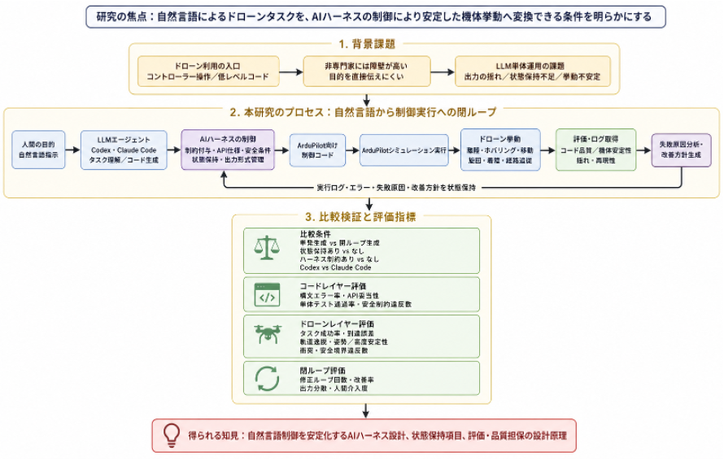

# 研究内容整理

## アーキテクチャ図

アーキテクチャ図は、このMarkdownファイル（`/Users/takagiyuuki/AI-Research-SKILLs/research object/hogehoge.md`）からの相対パス `./image.png` に存在する。

## 研究目的(日本語：80文字以上400文字以内,English：48～240 words)

> ※研究課題の内容及びその目的について、何のためにどのような研究を行うのかを具体的に記載してください。対象とする現象・課題、解決しようとする問題、得ようとする知見等を明確に示してください。

| 日本語 | English |
| --- | --- |
| 本研究の目的は、自然言語でドローンの経路や制約を変更し、その指示をAIハーネスにより安全制約付きの機体挙動へ変換する条件を明らかにすることである。従来は、非専門家が例えばドローンを目的に応じて動かすには、送信機操作、制御API、機体設定、コード記述の知識が必要であり、LLMが生成したコードも出力の揺れや文脈喪失により、そのまま実機へ適用しにくかった。本研究では、状態保持、制約付与、実行ログ解釈、評価・再生成を組み込むAIハーネスを設計し、自然言語による「高度を下げる」「危険領域を避ける」「経路を変更する」といった指示を、シミュレーションと実機飛行で検証可能な制御手順へ変換する。これにより、ドローンに限らず、移動ロボットや実験自動化装置へ展開可能な自然言語制御の設計原理を得る。 |  |

| 日本語 | English |
| --- | --- |
| 342 | 1 |

## 研究方法(日本語：160文字以上800文字以内,English：96～480 words)

> ※研究目的を達成するための具体的な方法を記載してください。研究プロセスを工程ごとに整理し、それぞれの工程においてAIをどのように適用又は開発するかを明確に示してください。また、使用するデータの種類・取得方法、評価指標及び検証方法についても可能な限り具体的に記載してください。

| 日本語 | English |
| --- | --- |
| 本研究では、自然言語指示をドローンの安定した挙動へ変換する過程を、①シミュレーション検証、②実機接続検証、③限定条件下の実機飛行の三段階で実施する。第一段階では、Mac上にArduPilot SITLと開発環境を構築し、Claude CodeおよびCodexを用いて、離陸、ホバリング、前後左右移動、旋回、着陸、簡易経路追従を対象に、自然言語から制御コードまたは高レベル指令を生成する。ここでは、単発生成と閉ループ生成、状態保持あり／なし、AIハーネスによる制約付与あり／なしを比較し、同じ指示を複数回与えた際の出力分散も確認する。第二段階では、Raspberry Piを伴走コンピュータとして用い、LLM制御モジュール、MAVLink通信、ログ収集を担わせる。Pixhawk系フライトコントローラは姿勢制御、センサー統合、フェイルセーフを担い、GPS、テレメトリ、電源モジュール、バッテリー、充電器を組み合わせて、実機と同じ通信・制御経路をプロペラなしまたは固定状態で確認する。第三段階では、開発用ドローン機体、プロペラガード、安全ネット等を用い、低高度・短時間・安全領域内で、自然言語による経路変更、速度・高度上限の変更、危険領域回避、異常時停止・着陸を検証する。たとえば「高度を1.5mに抑えて四角形経路を飛ぶ」「進入禁止領域を避けて帰還する」といった指示を、ハーネスが制約付きタスクに変換できるかを確認する。評価は、構文エラー率、実行時エラー率、安全制約違反数、タスク成功率、到達誤差、軌道逸脱量、姿勢・高度安定性、修正ループ回数、人間介入回数により行う。 |  |

| 日本語 | English |
| --- | --- |
| 682 | 4 |

## AI利活用の妥当性・実現可能性(日本語：160字以上800文字以内,English：96～480 words)

> ※当該研究課題においてAIを利活用する必要性及び妥当性について記載してください。従来手法では対応が困難である点や、AIを利活用することで実現可能となる事項を具体的に示し、当該研究におけるAI利活用の意義が明確となるようにしてください。

| 日本語 | English |
| --- | --- |
| 本研究でAIを利活用する妥当性は、自然言語で表現された人間の目的を、タスク仕様、制御コード、制約条件、失敗原因の解釈、改善方針へ連続的に変換できる点にある。従来のドローン制御は、操縦技能または低レベルなプログラミング能力に依存し、「もう少し高度を下げて同じ経路を通る」「この範囲には入らず迂回する」といった目的変更を、非専門家が即時に反映することは難しかった。一方で、LLMをそのまま物理システムへ接続すると、確率的生成によるコードの揺れ、危険なAPI呼び出し、過去の失敗文脈の喪失が問題となる。そこで本研究では、AIを自由生成器としてではなく、AIハーネス内の構成要素として用いる。具体的には、許可する命令範囲、速度・高度・飛行領域、フェイルセーフ条件を制約として与え、実行ログとテレメトリを状態として保持し、失敗時には原因を分類して再生成する。これにより、LLMが提案した経路やコードをそのまま採用するのではなく、事前検査、シミュレーション実行、評価指標による判定、人間介入条件を通過したものだけを実機検証へ進める。購入するMacは開発・SITL・ログ解析に、Raspberry Piは実機上の伴走計算機に、Pixhawk系フライトコントローラは低レベル制御と安全停止に、ドローン機体と周辺部材は限定飛行実験に用いる。Mac上のSITLで大部分の反復検証を行った後、実機へ段階的に移行するため、180日間のPoCとして安全性と実現可能性を両立できる。 |  |
